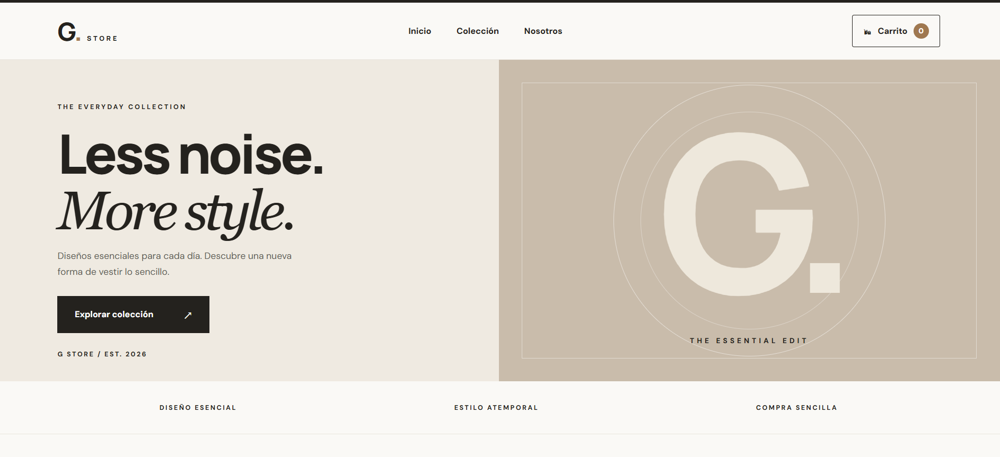
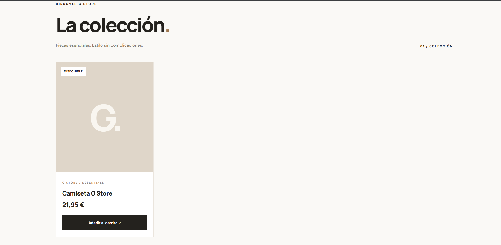
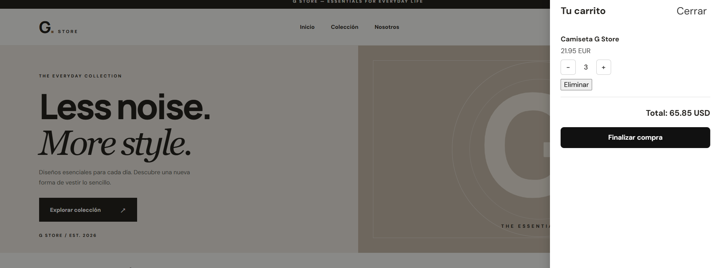
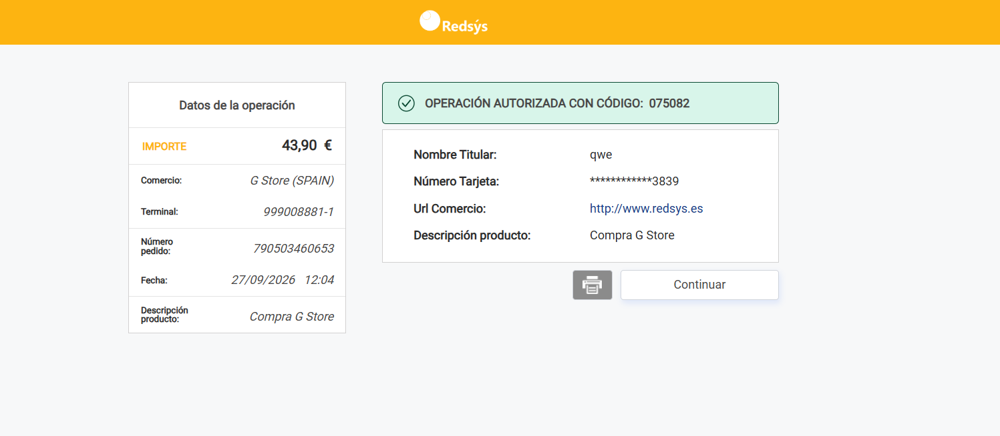
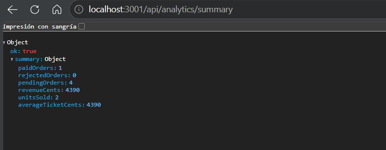
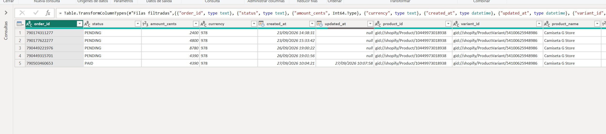
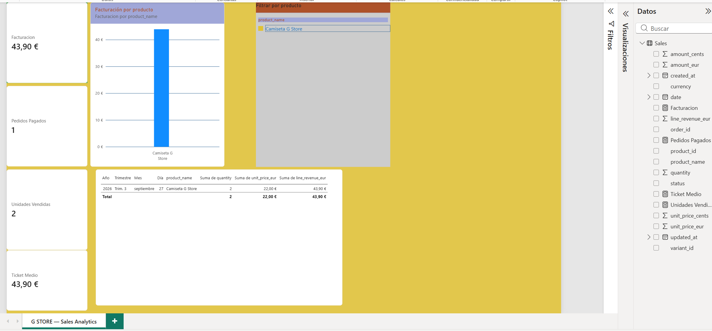

# G Store — Headless E-Commerce

G Store es un proyecto de e-commerce headless desarrollado como proyecto personal para integrar frontend, backend, APIs, pagos, bases de datos y análisis de datos en una única aplicación.

El proyecto conecta una tienda Shopify con un frontend desarrollado en React, un backend propio en Node.js y Express, pagos mediante Redsys Sandbox, persistencia con SQLite y una pipeline de analítica utilizando Python, Pandas, Excel y Power BI.
## Demo visual

A continuación se muestran algunas capturas del funcionamiento de G Store, incluyendo el frontend, el flujo de compra, la integración de pagos y la parte de analítica.

### Storefront principal



### Vista adicional del storefront



### Carrito de compra



### Pago autorizado con Redsys Sandbox



### Endpoint de analítica



### Informe en Excel



### Dashboard de Power BI




---

## Arquitectura

```text
Shopify
   │
   │ Storefront API / GraphQL
   ▼
React + Vite
   │
   │ REST
   ▼
Node.js + Express
   │
   ├── Shopify Storefront API
   │
   ├── Redsys Sandbox
   │
   └── SQLite
          │
          ▼
     Python + Pandas
          │
          ├── CSV
          └── Excel
                 │
                 ▼
              Power BI
```

---

## Tecnologías utilizadas

### Frontend

* React
* Vite
* JavaScript
* HTML
* CSS
* React Context API

### E-Commerce

* Shopify
* Shopify Storefront API
* GraphQL

### Backend

* Node.js
* Express
* REST API
* dotenv
* CORS

### Pagos

* Redsys Sandbox
* Firma HMAC-SHA512
* AES
* Webhooks
* Cloudflare Quick Tunnel

### Base de datos

* SQLite
* better-sqlite3
* SQL

### Data Analytics

* Python
* Pandas
* sqlite3
* OpenPyXL
* CSV
* Excel
* Power BI

### Control de versiones

* Git
* GitHub

---

# Funcionalidades

## Storefront

La aplicación obtiene los productos desde Shopify mediante GraphQL.

Entre los datos obtenidos se encuentran:

* nombre del producto;
* identificador;
* variante;
* precio;
* moneda;
* disponibilidad;
* imagen.

La tienda utiliza el contexto de mercado de España para obtener precios en EUR.

---

## Carrito de compra

El carrito está gestionado mediante React Context.

Permite:

* añadir productos;
* aumentar cantidades;
* disminuir cantidades;
* eliminar productos;
* calcular el total;
* consultar el número de productos;
* mantener el estado del carrito.

---

# Checkout seguro

Cuando el usuario inicia el checkout, el frontend no decide el precio final del pedido.

El backend recibe únicamente información como:

```text
variantId
quantity
```

A continuación consulta directamente Shopify para obtener el precio real de cada variante.

```text
React
   ↓
Express
   ↓
Shopify Storefront API
   ↓
Precio y disponibilidad reales
   ↓
Cálculo del pedido
```

Esto evita confiar en precios enviados directamente desde el navegador.

---

# Integración con Redsys

El proyecto integra la plataforma de pagos Redsys en su entorno Sandbox.

Flujo:

```text
Carrito
   ↓
Express
   ↓
Creación del pedido
   ↓
Firma de parámetros
   ↓
Redsys Sandbox
   ↓
Pago
   ↓
Webhook
   ↓
Verificación de firma
   ↓
SQLite
```

El backend genera los parámetros requeridos por Redsys y firma la operación.

También valida la notificación recibida después del pago.

Entre las comprobaciones realizadas se encuentran:

* firma de Redsys;
* ID del pedido;
* importe;
* moneda;
* código de comercio;
* terminal;
* tipo de operación;
* código de respuesta.

---

# Estados de pedido

Los pedidos pueden encontrarse en tres estados:

```text
PENDING
PAID
REJECTED
```

Un pedido se crea inicialmente como:

```text
PENDING
```

El estado cambia únicamente después de procesar la notificación enviada por Redsys.

La redirección del navegador después del pago no se utiliza como confirmación definitiva del pago.

---

# Persistencia con SQLite

Los pedidos se almacenan en SQLite.

El proyecto utiliza principalmente dos tablas:

## orders

Contiene información general del pedido:

```text
order_id
amount_cents
currency
transaction_type
status
redsys_response
authorisation_code
created_at
updated_at
```

## order_items

Contiene las líneas de cada pedido:

```text
order_id
product_id
variant_id
title
quantity
unit_price_cents
```

Existe una relación entre ambas tablas mediante `order_id`.

---

# API REST

El backend expone varios endpoints.

## Health check

```http
GET /api/health
```

Permite comprobar que el backend está funcionando.

---

## Crear checkout

```http
POST /api/checkout
```

Valida los productos contra Shopify, calcula el importe y prepara el pago con Redsys.

---

## Webhook Redsys

```http
POST /api/redsys/notification
```

Recibe la confirmación del pago enviada por Redsys.

---

## Consultar pedido

```http
GET /api/orders/:orderId
```

Obtiene un pedido junto con sus productos.

---

# Analytics API

También se desarrollaron endpoints específicos para análisis de ventas.

## Resumen

```http
GET /api/analytics/summary
```

Devuelve métricas como:

* pedidos pagados;
* pedidos pendientes;
* pedidos rechazados;
* facturación;
* unidades vendidas;
* ticket medio.

---

## Ventas por producto

```http
GET /api/analytics/products
```

Permite obtener:

* producto;
* unidades vendidas;
* facturación;
* número de pedidos.

---

## Ventas por día

```http
GET /api/analytics/daily
```

Agrupa los pedidos pagados por fecha.

---

# Pipeline de datos

Para la parte de Business Intelligence se desarrolló una pequeña pipeline ETL.

```text
SQLite
   ↓
Python
   ↓
Pandas
   ↓
Transformación
   ↓
CSV / Excel
   ↓
Power BI
```

---

## Python y Pandas

El script:

```text
server/analytics/export_sales.py
```

realiza las siguientes operaciones:

### Extract

Obtiene pedidos y líneas de pedido desde SQLite.

### Transform

Realiza transformaciones como:

```text
céntimos → euros
timestamps → fechas
cantidad × precio → facturación por línea
```

### Load

Genera:

```text
sales.csv
sales.xlsx
```

Estos archivos se generan automáticamente y no se almacenan en Git.

---

# Excel

El dataset generado se utilizó para practicar análisis mediante Excel.

Se trabajó con:

* tablas;
* filtros;
* formato monetario;
* tablas dinámicas;
* facturación por producto;
* unidades vendidas;
* KPIs;
* gráficos.

Las ventas reales se calculan utilizando únicamente pedidos:

```text
status = PAID
```

---

# Power BI

Los datos también se importaron en Power BI.

Se creó el dashboard:

```text
GStore_Sales_Dashboard.pbix
```

Incluye indicadores como:

```text
Facturación
Pedidos pagados
Unidades vendidas
Ticket medio
```

También incluye:

* facturación por producto;
* evolución de facturación;
* segmentación por producto;
* tabla de detalle.

---

# Medidas DAX

Algunas de las medidas creadas son:

```DAX
Facturacion =
SUM(Sales[line_revenue_eur])
```

```DAX
Pedidos Pagados =
DISTINCTCOUNT(Sales[order_id])
```

```DAX
Unidades Vendidas =
SUM(Sales[quantity])
```

```DAX
Ticket Medio =
DIVIDE(
    [Facturacion],
    [Pedidos Pagados],
    0
)
```

---

# Seguridad

El proyecto utiliza variables de entorno para evitar almacenar credenciales directamente en el código.

Ejemplo:

```text
VITE_SHOPIFY_STORE_DOMAIN=
VITE_SHOPIFY_STOREFRONT_TOKEN=
VITE_SHOPIFY_API_VERSION=

REDSYS_URL=
REDSYS_MERCHANT_CODE=
REDSYS_TERMINAL=
REDSYS_SECRET_KEY=

PUBLIC_BACKEND_URL=
```

El repositorio incluye:

```text
.env.example
```

como referencia de configuración.

Los archivos `.env` reales están excluidos mediante `.gitignore`.

También se excluyen:

```text
SQLite databases
CSV exports
Excel exports
temporary database files
```

---

# Instalación

## 1. Clonar repositorio

```bash
git clone <repository-url>
cd react-storefront
```

---

## 2. Instalar frontend

```bash
npm install
```

---

## 3. Configurar variables de entorno

Crear:

```text
.env
```

utilizando `.env.example` como referencia.

---

## 4. Ejecutar frontend

```bash
npm run dev
```

Por defecto:

```text
http://localhost:5173
```

---

## 5. Instalar backend

```bash
cd server
npm install
```

---

## 6. Configurar backend

Crear:

```text
server/.env
```

con las variables necesarias de Shopify y Redsys.

---

## 7. Ejecutar backend

```bash
npm run dev
```

Por defecto:

```text
http://localhost:3001
```

---

# Analytics con Python

Crear o activar un entorno virtual e instalar:

```bash
python -m pip install pandas openpyxl
```

Ejecutar:

```bash
python analytics/export_sales.py
```

Los archivos se generan en:

```text
server/analytics/exports/
```

---

# Power BI

El dashboard se encuentra en:

```text
server/analytics/powerbi/GStore_Sales_Dashboard.pbix
```

---

# Estructura simplificada

```text
react-storefront/
│
├── src/
│   ├── components/
│   ├── context/
│   ├── lib/
│   ├── App.jsx
│   └── main.jsx
│
├── server/
│   ├── analytics/
│   │   ├── export_sales.py
│   │   ├── exports/
│   │   └── powerbi/
│   │       └── GStore_Sales_Dashboard.pbix
│   │
│   ├── data/
│   ├── scripts/
│   └── src/
│       ├── database.js
│       ├── orderRepository.js
│       ├── redsys.js
│       ├── server.js
│       └── shopify.js
│
├── .env.example
├── .gitignore
├── package.json
└── README.md
```

---

# Conceptos trabajados

Durante el desarrollo del proyecto se han trabajado conceptos como:

* arquitectura cliente-servidor;
* APIs REST;
* GraphQL;
* APIs externas;
* React Context;
* variables de entorno;
* backend con Express;
* firma criptográfica;
* webhooks;
* validación server-side;
* persistencia;
* diseño relacional;
* SQL;
* ETL;
* Pandas DataFrames;
* Excel;
* Power BI;
* DAX;
* Git;
* GitHub.

---

# Posibles mejoras futuras

Algunas posibles ampliaciones serían:

* autenticación de usuarios;
* historial de pedidos por usuario;
* más productos y categorías;
* PostgreSQL;
* Docker;
* tests automatizados;
* despliegue del frontend y backend;
* panel administrativo;
* autenticación para endpoints de analytics;
* CI/CD;
* actualización automática de datasets de Power BI.

---

# Objetivo del proyecto

El objetivo principal de G Store ha sido desarrollar un proyecto full-stack que vaya más allá de una tienda visual.

La aplicación integra distintas áreas:

```text
Frontend
Backend
APIs
Pagos
Bases de datos
Seguridad
Python
Data Analytics
Business Intelligence
```

De esta forma el proyecto muestra el flujo completo desde que un usuario visualiza un producto hasta que una venta termina almacenada, procesada y representada en un dashboard de análisis.
